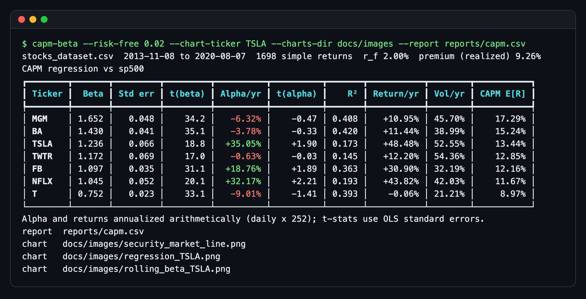
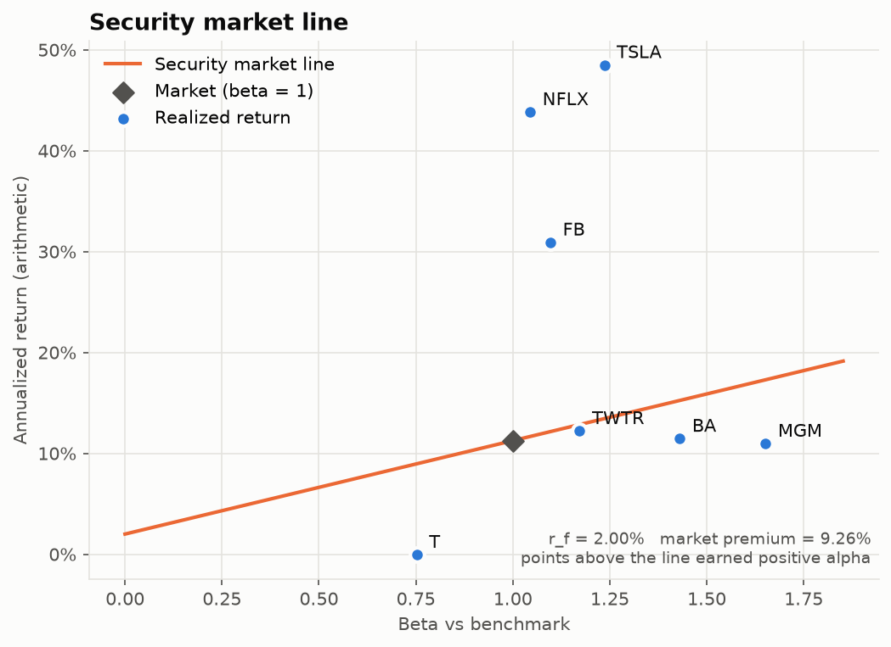
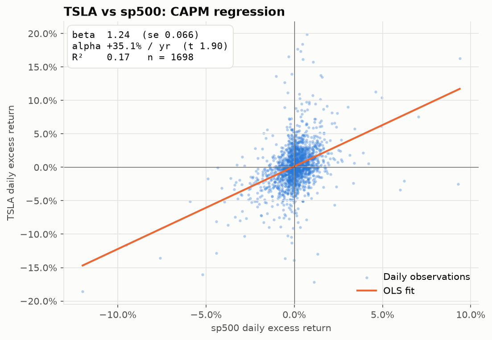
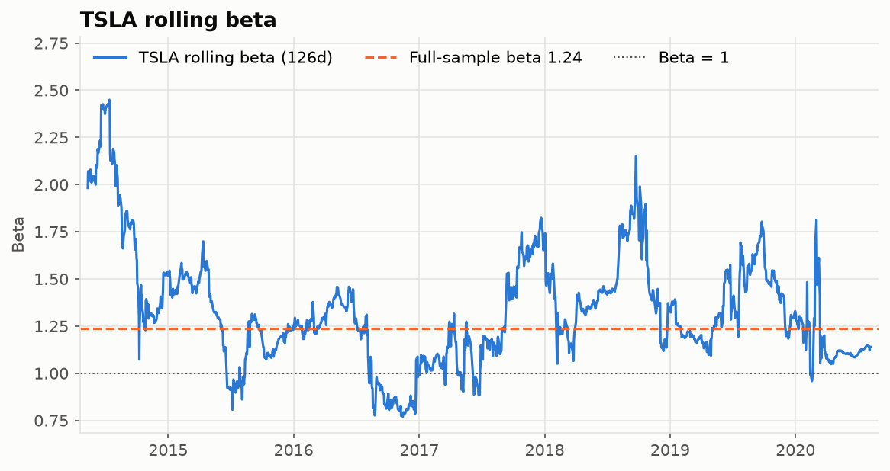

# CAPM Beta Analyzer

[](https://github.com/jovanshernandez/capm-beta-analyzer/actions/workflows/ci.yml)

A small Python package and CLI that estimates each stock's market exposure under the Capital
Asset Pricing Model. Give it a CSV of daily closes with a benchmark column and it regresses
each stock's excess returns on the market's, reporting beta, annualized alpha, R², standard
errors and t-statistics, the CAPM expected return for a chosen risk-free rate and market
premium, and a rolling beta to show how exposure changes over time. The numbers come with
their uncertainty: a beta of 1.24 with a standard error of 0.07 says something different
from a beta of 1.24 with a standard error of 0.5, and an alpha of +35% a year with a t-stat
of 1.9 is not yet evidence of skill.



| Security market line | TSLA regression |
| --- | --- |
|  |  |



All images above were produced by the command shown in the terminal screenshot, run against
the bundled dataset.

## Features

- OLS beta and alpha on excess returns, with R², standard errors and t-stats for both
- Simple or log returns, vectorized with pandas
- Annual risk-free rate converted to a per-period rate that matches the return method
- CAPM expected return from a given market premium, or the premium realized in the sample
- Rolling beta over a trailing window
- CSV report and PNG charts: security market line, regression scatter, rolling beta
- Input validation with clear errors: missing columns, duplicate dates, non-positive prices,
  incomplete rows are dropped

## Quick start

Requires Python 3.10 or newer.

```bash
git clone https://github.com/jovanshernandez/capm-beta-analyzer.git
cd capm-beta-analyzer
python3 -m venv .venv
source .venv/bin/activate
pip install -e ".[dev]"
```

Run against the bundled dataset (seven stocks and the S&P 500, Nov 2013 to Aug 2020):

```bash
capm-beta
capm-beta --risk-free 0.02 --chart-ticker TSLA --charts-dir charts --report reports/capm.csv
capm-beta --tickers TSLA NFLX T --returns log --risk-free 0.04 --market-premium 0.05 --sort alpha
capm-beta --chart-ticker BA --rolling-window 63 --charts-dir charts
capm-beta --help
```

Use your own data with `--csv`. The file needs a date column and one price column per
security, including the benchmark:

```text
Date,AAPL,MSFT,SPY
2024-01-02,185.64,370.87,472.65
2024-01-03,184.25,370.60,468.79
```

```bash
capm-beta --csv data/stocks_dataset.csv --benchmark sp500 --tickers FB --report reports/fb.csv
```

The package can also be used directly:

```python
from capm_beta_analyzer import analyze, compute_returns, load_prices, rolling_beta

prices = load_prices(benchmark="sp500")
returns = compute_returns(prices, "simple")
results, premium = analyze(returns, "sp500", risk_free=0.02)
tsla_beta = rolling_beta(returns, "TSLA", "sp500", window=126)
```

## How it works

**The regression.** CAPM says a stock's expected excess return is proportional to the
market's: `E[R_i] - r_f = beta * (E[R_m] - r_f)`. The tool estimates
`r_i - r_f = alpha + beta * (r_m - r_f) + e` by ordinary least squares on daily data.
Beta is `Cov(r_i, r_m) / Var(r_m)`: how many percent the stock tends to move for a 1% move in
the market. Alpha is the average return left over after accounting for that exposure.

**Uncertainty.** Standard errors use the classical OLS formula, so the t-stat on beta tests
"does this stock move with the market at all" and the t-stat on alpha tests "is the excess
performance distinguishable from zero". With roughly 1,700 daily observations, betas are
tightly estimated (t-stats of 17 to 35 here), while every alpha in the sample has |t| near or
below 2. R² is the share of daily variance explained by the market; the rest is
stock-specific risk, which CAPM says diversification removes and the market does not pay for.

**Rates and annualization.** `--risk-free` is an annual rate. It is converted to a daily
rate by compounding for simple returns, `(1 + r_f)^(1/252) - 1`, or by dividing the
continuously compounded rate for log returns, `ln(1 + r_f) / 252`. Alpha and mean returns are
annualized arithmetically (daily value times 252) and volatility by `sqrt(252)`.

**Expected return and the security market line.** `CAPM E[R] = r_f + beta * premium`. If
`--market-premium` is not given, the realized mean market excess return over the sample is
used. In that case OLS guarantees each stock's mean excess return equals
`alpha + beta * premium`, so on the security market line chart the vertical distance from a
point to the line is that stock's alpha.

**Rolling beta.** The same `Cov / Var` ratio over a trailing window (126 trading days, about
six months, by default). A constant risk-free rate shifts both series equally, so it does not
affect beta. Full-sample beta averages over regimes; the rolling view shows how far exposure
drifts, for example TSLA ranging from about 0.8 to 2.4 over this sample.

**Limits.** This is a single-factor model on a fixed historical window. Classical standard
errors assume homoskedastic, uncorrelated residuals, which daily equity returns violate, so
the t-stats are a guide rather than a formal test. The bundled data ends in 2020.

## Testing

```bash
pytest -q
```

The tests build synthetic markets where the answer is known (an asset defined as
`0.0002 + 1.5 * market + noise`) and check that beta, alpha and R² are recovered within their
standard errors, that the OLS fit matches `numpy.polyfit`, that rolling beta picks up a
regime change from 0.5 to 2.0, and that the CLI writes a valid report and charts. GitHub
Actions runs the suite on Python 3.12 for every push and pull request.

## Project layout

```text
capm_beta_analyzer/
  data.py      load and validate the price CSV
  returns.py   simple and log returns, annual to per-period rate conversion
  capm.py      OLS fit, CAPM analysis, expected return, rolling beta
  charts.py    matplotlib charts (Agg backend)
  cli.py       capm-beta command
data/
  stocks_dataset.csv   sample daily closes: FB, TWTR, NFLX, BA, T, MGM, TSLA, sp500
docs/images/   screenshots and charts used in this README
tests/         pytest suite with synthetic data
```
